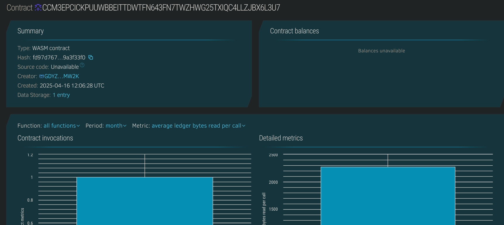

# NFT Trading Simulator

## 📌 Project Title
**NFT Trading Simulator**

---

## 📄 Project Description
NFT Trading Simulator is a simple yet powerful Soroban-based smart contract that allows users to mint NFTs and simulate trading (transferring) them between different addresses. This contract mimics a trading environment where users can practice managing NFT ownership and understand the flow of assets in a decentralized setting.

---

## 🎯 Project Vision
The vision of this project is to build a safe and interactive simulation environment for NFT minting and trading. This can be used by blockchain learners, hackathon participants, or platforms looking to demo NFT mechanics without deploying a full production-grade marketplace.

---

## 🚀 Key Features
- 🎨 NFT Minting with unique ID and metadata
- 🔁 NFT Trading/Transfer simulation between users
- 👛 View NFTs owned by any user
- ⚡ Efficient and minimal design for quick experimentation

---

## 🔮 Future Scope
- 🛍️ Integrate with a frontend NFT simulator UI
- 📈 Add support for simulated bidding or auctions
- 🧾 Track trade history and simulate transaction fees
- ⛓️ Upgrade for integration with real NFT standards (e.g. Stellar NFT specs)
- 👮 Role-based controls for minting and trading limits

## Contract Details
CCM3EPCICKPUUWBBEITTDWTFN643FN7TWZHWG25TXIQC4LLZJBX6L3U7
